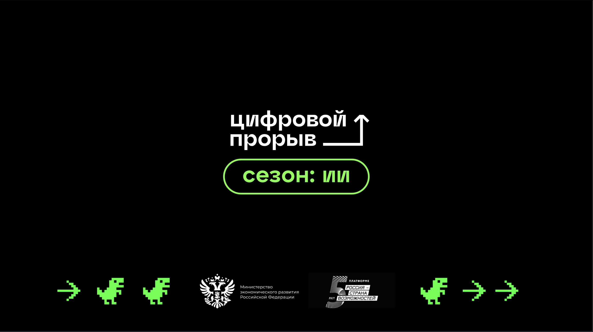

# Кейс "Победи отток клиентов в сфере быстрого питания"

## Описание кейса

В рамках данного хакатона, организованного DCS совместно с ООО "БУРГЕР РУС", наша команда разрабатывает модель машинного обучения, способную предсказать отток клиентов в сети ресторанов быстрого питания. Модель будет основываться на аналитике больших данных и предсказывать вероятность оттока действующих клиентов, помогая бизнесу своевременно реагировать и удерживать ценных клиентов.

В качетве модели была выбрана Catboost
Весь код выполнялся на языке Python и его библиотеках с открытым исходным кодом
Имеет следующие преимущетва:
1. быстрая развертываемость в реальном бизнесе, 
2. высокая интерпретируемость, 
3. весьма неплохая точность

## Над кейсом работали

#### *Попов Матвей*
Капитан команды
Отвечаю за то, что бы работали все и всё.
Студент 4  курса мехмата ТГУ
Data Scientist в компании VR GO 
Люблю математику, девушек и настолки

#### *Карлов Иван*
ML-разработчик
Разрабатываю модели, проверяю гипотезы
Студент 3 курса ИПМКН ТГУ
Junior ML CV engineer в IndorSoft

#### *Соколов Владислав*
ML-разработчик
Разрабатываю модели, проверяю гипотезы
Студент 4 курса ИПМКН ТГУ
Junior ML Developer в Сибирском Центре  ИИ

